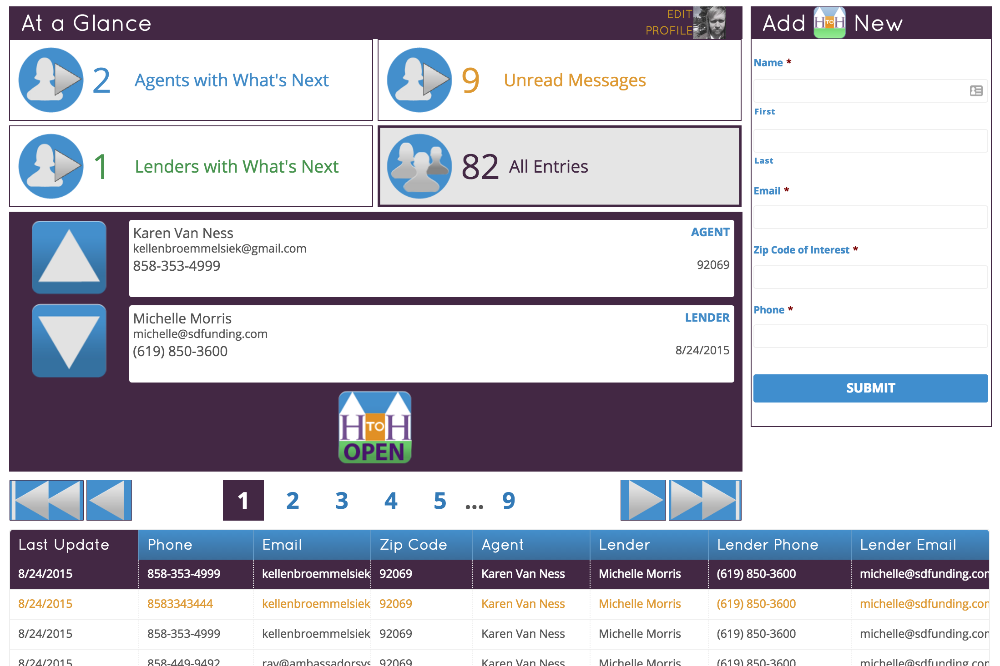

Dashboards are what the end-user will see when managing their home to homes.

You can create as many dashboards as you like and customize each one individually.

**Please visit the [Required Plugins](/required-plugins/) page in order to make sure all required plugins are activated before proceeding.**

This page will cover:

* TOC
{:toc}

## Create A Dashboard

You can now dynamically create as many dashboards as you need. Even though the typical is only the 3 (client, agent, lender), this gives you full control over each one and the ability to create more if needed, like for testing. To do so go to Dashboards in the admin menu. It's managed like any other post type. Add New or edit an existing one.

There are a lot of settings to take in here. I recommend setting up a test dashboard to get a feel for how it works. I will cover some of the less self-explanatory details here.

### Connect the dashboard to a Google Sheet

*Note: You will need to connect the site to Google first. Instructions on how to do so can be found [here](/ambassador-docs/google-sheets#integrating-website).*

The first thing that you need to do is connect the dashboard to a Google Sheet. Use the metabox labelled "Dashboard Display Google Sheet". Once you select/change the sheet, all column selectboxes on the page will populate with the available sheet column headers. It is important that your sheet has column headers. Simply name the first row cells for each column you will be using.

### Connect the dashboard to a Gravity Form

*Note: You will need to create a form and setup a feed. Instructions on how to do so can be found [here](/ambassador-docs/google-sheets#feeds).*

Each dashboard can submit a request to the Google Sheet to add a new row. This is why you have to connect this dashboard to a sheet. Next, you have to connect the dashboard to a form for making the submission. You will need to create a form, setup the Google Sheet feed, and then select that form when creating the dashboard. You can select the form in the metabox labelled "Submit Form".

### Setup the entry filtering

The user viewing the dashboard only needs to see specific entries, typically in some way associated with their account email. The metabox "Filter Entries" allows you to set this up. Simply select a column from the selectbox that will contain the user's email address in each entry. Only entries that match the logged in user's email address to the value in that entry's column will be shown.

You can also enter a "Custom Email" to match against instead of the logged in user's email address. Technically speaking, you could enter any value here and it would match against whichver column you choose.

### Show the dashboard on a page

The dashboard can be displayed by using the shortcode `[ambassador_dashboard id="N"]`, where "N" is the dashboard ID. You can copy and paste the provided shortcode from the metabox "How to Use" and place it any page or post. I recommending doing so now on a test page so that you can continually preview your dashboard and ensure it is setup right.

### Everything else

Now go through and setup everything else. All other settings are visual and mostly self-explanatory. Simply edit the settings, update the dashboard, and then preview your changes.